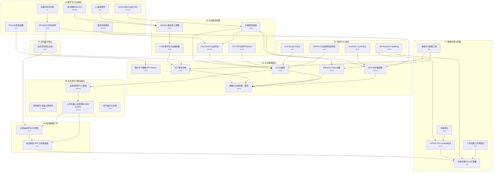

# 具身智能 (Embodied AI / VLA) 全栈知识图谱

> **48 篇笔记 · 9 大模块 · 3 条学习路径**
> 从数学基础到 VLA 大模型，从经典控制到 Sim-to-Real 部署——构建具身智能的完整知识体系。

---

## 目录树

```
具身智能与机器人学习/
│
├── 00-具身智能总览.md                    ← 你在这里
│
├── 01-数学与几何基础/                    (7 篇)
│   ├── 向量内积与外积.md                 ← 线性代数基石
│   ├── KL散度推导.md                     ← 信息论基础
│   ├── Policy与损失函数.md               ← 策略优化数学
│   ├── SE3与SO3空间变换.md               ← 刚体运动群论
│   ├── 变分推断与ELBO.md                 ← VAE/扩散的理论根
│   ├── Score-Matching与SDE.md            ← 扩散模型数学核心
│   └── 最优传输理论.md                   ← Flow Matching 理论基础
│
├── 02-视觉与3D感知/                      (4 篇)
│   ├── CLIP与SigLIP对比.md               ← VLA 视觉塔选型
│   ├── DINOv2与自监督视觉特征.md          ← 密集视觉特征提取
│   ├── PointNet++与3D点云.md              ← 3D 点云编码器
│   └── 3D-Gaussian-Splatting.md           ← 实时 3D 重建与仿真
│
├── 03-生成模型原理/                       (5 篇)
│   ├── CVAE条件变分自编码器.md            ← 条件生成 → ACT 引擎
│   ├── VAE与KL散度深入理解.md             ← 隐空间与重参数化
│   ├── 扩散模型基础.md                    ← DDPM/DDIM/Classifier-Free
│   ├── Flow-Matching流匹配.md             ← 直线 ODE 快速生成
│   └── VQ-VAE与动作Token化.md             ← 离散动作 → RT-2 Token
│
├── 04-动作空间表征/                       (2 篇)
│   ├── 动作空间表征总览.md                ← EEF vs 关节角 / Chunking
│   └── 从策略输出到真机执行.md            ← 策略输出 → IK → 关节执行链路
│
├── 05-主流策略模型/                       (6 篇)
│   ├── ACT算法详解.md                     ← CVAE + Transformer 策略
│   ├── Diffusion-Policy详解.md            ← 扩散去噪 → 动作
│   ├── DP3-3D扩散策略.md                  ← 3D 点云 + 扩散策略
│   ├── VLA大模型.md                       ← RT-2/OpenVLA/π₀ 大一统
│   ├── 强化学习策略-PPO与SAC.md            ← RL 互补模仿学习
│   └── 策略与生成的统一趋势.md             ← 端到端大一统范式
│
├── 06-经典机器人学/                       (2 篇)
│   ├── 正逆运动学与PID控制.md             ← 底层执行
│   └── 轨迹规划-RRT与样条插值.md           ← 路径规划与平滑
│
├── 07-数据仿真与部署/                     (5 篇)
    ├── NVIDIA-Sim-to-Real技术.md           ← Isaac Sim / Domain Rand
    ├── 仿真引擎与ROS2部署.md               ← MuJoCo/Isaac + ROS2 管线
    ├── 人形机器人开源框架.md               ← Humanoid 开源生态
    ├── 遥操作与数据工程.md                 ← ALOHA / LeRobot 数据采集
    └── 系统辨识.md                         ← 真机参数 → 仿真标定
│
├── 08-端到端VLA与分层架构/                (10 篇)
    ├── 端到端VLA与分层架构-概览与学习路径.md   ← 概览 + 学习路径
    ├── 端到端VLA模型盘点-上.md                ← Octo / OpenVLA / GR-2
    ├── 端到端VLA模型盘点-下.md                ← RDT-1B / π0 / GraspVLA / GO-1
    ├── 端到端与分层架构之争.md                ← 架构辩论 + Scaling Law 困境
    ├── 世界模型与VLA集成.md                  ← LeCun / FLIP / MDP
    ├── 分层架构-VLM加运动规划.md              ← VoxPoser / ReKep / Vila+CoPa / OmniManip
    ├── 分层架构-VLM加技能控制器.md            ← HumanPlus / Susie / ATM / ManipGen
    ├── VLA下一步-动作形式与整身协同.md         ← 整身协同 / WBC / MPC
    ├── 从VLM到空间智能.md                    ← 3D-GS / RoboGSim / CAST
    ├── ChatVLA与训练范式解耦.md               ← 虚假遗忘 / 任务干扰 / MoE
│
└── 09-全身协同与移动操作/                 (6 篇)
    ├── 09-全身协同与移动操作-概览.md          ← 模块入口 + 学习路径
    ├── 移动操作-底盘与臂协同.md              ← 底盘+臂：移动操作
    ├── 人形机器人全身控制-WBC与MPC.md        ← 腿+臂+平衡：WBC/MPC
    ├── 双手操作与协调.md                     ← 双臂协调
    ├── 全身协同的VLA集成.md                  ← VLA 高层 + WBC 低层
    └── 全身动作数据采集与仿真.md             ← 整身数据采集 + 仿真合成
```

---

## 依赖关系图



> **图例**：实线箭头 `→` = 强依赖（前置必读），虚线 `-.->` = 互补/参考关系。
> 难度标注：⭐ = 入门，⭐⭐ = 中等，⭐⭐⭐ = 进阶，⭐⭐⭐⭐ = 研究级。

---

## 一、数学与几何基础（7 篇）

> **为什么先读数学？** 具身智能所有 SOTA 方法的创新本质是数学变换。扩散策略 = Score-Matching + SDE，ACT = 变分推断 + CVAE，π₀ = 最优传输 + Flow Matching。跳过数学读论文 = 看魔术不看机关。

| # | 文件名 | WikiLink | 一句话描述 | 前置依赖 | SOTA 关联 |
|---|--------|----------|-----------|---------|----------|
| 1 | 向量内积与外积.md | [[向量内积与外积]] | 点积/叉积的几何意义，理解旋转与投影的数学语言 | 无 | SE(3) 变换、PointNet 对称函数 |
| 2 | KL散度推导.md | [[KL散度推导]] | 从信息论到概率分布距离度量，推导 KL(p∥q) 公式 | 向量内积与外积 | VAE 损失、RL 策略约束、ELBO |
| 3 | Policy与损失函数.md | [[Policy与损失函数]] | 策略梯度、MSE/BCE/Huber 损失在机器人学习中的应用 | KL散度推导 | PPO 目标函数、ACT L1 损失、扩散 MSE |
| 4 | SE3与SO3空间变换.md | [[SE3与SO3空间变换]] | 刚体运动群：旋转矩阵、四元数、李代数，机械臂运动学语言 | 向量内积与外积 | DP3 SE(3)-等变性、动作空间表征、6D 位姿估计 |
| 5 | 变分推断与ELBO.md | [[变分推断与ELBO]] | 当后验不可算时，用可优化分布近似 + ELBO 作为优化目标 | KL散度推导 | VAE 训练目标、CVAE 条件生成、ACT β-VAE |
| 6 | Score-Matching与SDE.md | [[Score-Matching与SDE]] | Score function、去噪得分匹配、正向/逆向 SDE 统一框架 | 变分推断与ELBO | DDPM、Diffusion Policy、Consistency Model |
| 7 | 最优传输理论.md | [[最优传输理论]] | Monge-Kantorovich 问题、Wasserstein 距离、直线传输路径 | Score-Matching与SDE | Flow Matching、π₀ 动作生成、Rectified Flow |

---

## 二、视觉与3D感知（4 篇）

> **为什么重要？** VLA 模型的"眼睛"质量决定策略天花板。OpenVLA 用 SigLIP+DINOv2 双塔，DP3 用 PointNet++ 替代 2D CNN——视觉编码器的选择直接影响 SE(3) 等变性和 Sim-to-Real 泛化。

| # | 文件名 | WikiLink | 一句话描述 | 前置依赖 | SOTA 关联 |
|---|--------|----------|-----------|---------|----------|
| 1 | CLIP与SigLIP对比.md | [[CLIP与SigLIP对比]] | CLIP 对比学习 vs SigLIP Sigmoid Loss，VLA 视觉塔选型指南 | 无 | OpenVLA 视觉编码器、RT-2 ViT 选型 |
| 2 | DINOv2与自监督视觉特征.md | [[DINOv2与自监督视觉特征]] | Teacher-Student 自蒸馏 → 密集 patch 特征 → 像素级空间理解 | CLIP与SigLIP对比 | OpenVLA 双塔视觉、3D 对应点匹配 |
| 3 | PointNet++与3D点云.md | [[PointNet++与3D点云]] | 无序点集的置换不变编码：Set Abstraction → 层级特征 → 全局描述子 | 向量内积与外积 | DP3 点云编码器、6D 位姿估计 |
| 4 | 3D-Gaussian-Splatting.md | [[3D-Gaussian-Splatting]] | 显式 3D 高斯基元 → 实时可微渲染 → 比 NeRF 快 100× | PointNet++与3D点云 | Sim-to-Real 数字孪生、NVIDIA Isaac Sim 场景重建 |

---

## 三、生成模型原理（5 篇）

> **为什么是引擎？** 当前 SOTA 具身策略（ACT、Diffusion Policy、π₀）的本质都是生成模型——把预测动作当作"从噪声中生成合理轨迹"。理解 VAE → Diffusion → Flow Matching 的演进，就是理解策略模型的演进。

| # | 文件名 | WikiLink | 一句话描述 | 前置依赖 | SOTA 关联 |
|---|--------|----------|-----------|---------|----------|
| 1 | CVAE条件变分自编码器.md | [[CVAE条件变分自编码器]] | 条件 VAE：给定观测编码隐变量 → 解码动作，ACT 的核心引擎 | 变分推断与ELBO、VAE与KL散度深入理解 | ACT Action Chunking、Behavior Cloning |
| 2 | VAE与KL散度深入理解.md | [[VAE与KL散度深入理解]] | 重参数化技巧 + KL 正则化 → 连续平滑隐空间 | 变分推断与ELBO、KL散度推导 | CVAE 架构基础、潜在动作空间 |
| 3 | 扩散模型基础.md | [[扩散模型基础]] | DDPM 前向加噪 + 逆向去噪 + Classifier-Free Guidance 完整推导 | Score-Matching与SDE | Diffusion Policy、DP3、视频扩散世界模型 |
| 4 | Flow-Matching流匹配.md | [[Flow-Matching流匹配]] | 从 SDE 到 ODE：直线概率路径 → 1~10 步推理替代 100~1000 步扩散 | 扩散模型基础、最优传输理论 | π₀ 动作生成、Octo 扩散头、实时推理 |
| 5 | VQ-VAE与动作Token化.md | [[VQ-VAE与动作Token化]] | 向量量化：连续动作 → 离散 Codebook → LLM 自回归预测 | VAE与KL散度深入理解 | RT-2 动作 Token 化、Gato 多模态 Token |

---

## 四、动作空间表征（2 篇）

> **为什么只两篇？** 动作表征是连接「策略输出」与「机器人执行」的关键翻译层。从 ACT 的关节角 Chunking 到 Diffusion Policy 的 EEF 增量——选错表征，策略再好也跑不起来。

| # | 文件名 | WikiLink | 一句话描述 | 前置依赖 | SOTA 关联 |
|---|--------|----------|-----------|---------|----------|
| 1 | 动作空间表征总览.md | [[动作空间表征总览]] | 时间维度 Chunking + 空间维度 EEF vs 关节角 + 参考系选择 | SE3与SO3空间变换 | 所有策略模型的表征选择依据 |
| 2 | 从策略输出到真机执行.md | [[从策略输出到真机执行]] | 策略动作块 → IK → 关节角 → 底层控制器 的完整执行闭环 | 动作空间表征总览、正逆运动学与PID控制 | ACT/Diffusion Policy/VLA 的真机落地链路 |

---

## 五、主流策略模型（6 篇）

> **为什么是核心？** 这是具身智能的"发动机"——所有数学、视觉、生成模型最终都汇聚到这里，输出机器人的行为决策。

| # | 文件名 | WikiLink | 一句话描述 | 前置依赖 | SOTA 关联 |
|---|--------|----------|-----------|---------|----------|
| 1 | ACT算法详解.md | [[ACT算法详解]] | CVAE + Transformer Encoder → Action Chunking，ALOHA 官方策略 | CVAE条件变分自编码器、动作空间表征总览 | ALOHA 双臂操作、低成本机器人模仿学习 |
| 2 | Diffusion-Policy详解.md | [[Diffusion-Policy详解]] | 扩散模型去噪 → 动作生成：UNet/U-Net 条件去噪 + 时域平滑 | 扩散模型基础、动作空间表征总览 | 通用操作策略、Push-T / Transport 基准 |
| 3 | DP3-3D扩散策略.md | [[DP3-3D扩散策略]] | PointNet++ 点云编码 + Diffusion Policy → SE(3)-等变动作生成 | Diffusion-Policy详解、PointNet++与3D点云、SE3与SO3空间变换 | 3D 感知策略、视角不变操作、Sim-to-Real |
| 4 | VLA大模型.md | [[VLA大模型]] | RT-2 / OpenVLA / Octo / π₀：语言+视觉→动作的端到端大一统模型 | CLIP与SigLIP对比、VQ-VAE与动作Token化、Flow-Matching流匹配 | 通用具身基础模型、2024-2025 最前沿 |
| 5 | 强化学习策略-PPO与SAC.md | [[强化学习策略-PPO与SAC]] | PPO Clip 目标 + SAC 最大熵 + RLPD 混合训练 | Policy与损失函数 | Isaac Gym/Lab 大规模并行训练 |
| 6 | 策略与生成的统一趋势.md | [[策略与生成的统一趋势]] | VLA 大一统 + 世界模型即策略 + 万物皆 Token——2024-2025 范式转移 | ACT算法详解、Diffusion-Policy详解、VLA大模型 | 下一代具身大模型架构 |

---

## 六、经典机器人学（2 篇）

> **为什么还要学经典？** 端到端策略目前不稳定——高精度操作仍需 IK + PID 兜底。策略输出"目标位姿"→ 轨迹规划生成路径 → IK 求解关节角 → PID 执行——这条经典管线是可靠性的底线。

| # | 文件名 | WikiLink | 一句话描述 | 前置依赖 | SOTA 关联 |
|---|--------|----------|-----------|---------|----------|
| 1 | 正逆运动学与PID控制.md | [[正逆运动学与PID控制]] | FK/IK 推导 + DH 参数 + PID 调参：从目标位姿到关节力矩的完整链路 | SE3与SO3空间变换 | 所有物理机器人底层控制、Sim-to-Real 执行一致性 |
| 2 | 轨迹规划-RRT与样条插值.md | [[轨迹规划-RRT与样条插值]] | RRT/RRT* 概率路径规划 + 样条平滑 → 策略与控制之间的桥梁 | 正逆运动学与PID控制 | 运动规划、避障、人形机器人全身控制 |

---

## 七、数据仿真与部署（5 篇）

> **为什么最后读？** 算法在有数据的仿真环境中训练，在真实机器人上验证——这 5 篇构成「数据→训练→部署」的完整工程闭环。

| # | 文件名 | WikiLink | 一句话描述 | 前置依赖 | SOTA 关联 |
|---|--------|----------|-----------|---------|----------|
| 1 | NVIDIA-Sim-to-Real技术.md | [[NVIDIA-Sim-to-Real技术]] | Domain Randomization + Isaac Sim：让仿真策略在真实世界不崩 | 3D-Gaussian-Splatting、系统辨识 | 工业级 Sim-to-Real 管线 |
| 2 | 仿真引擎与ROS2部署.md | [[仿真引擎与ROS2部署]] | MuJoCo/Isaac Gym/Isaac Sim 对比 + ROS2 推理→控制闭环 | 轨迹规划-RRT与样条插值、NVIDIA-Sim-to-Real技术 | 端到端部署管线 |
| 3 | 人形机器人开源框架.md | [[人形机器人开源框架]] | HumanoidBench、ExBody、ASAP 等人形机器人开源生态 | 仿真引擎与ROS2部署 | 人形机器人全身控制 |
| 4 | 遥操作与数据工程.md | [[遥操作与数据工程]] | ALOHA Leader-Follower 架构 + HDF5/Zarr 数据格式 + LeRobot 管线 | 动作空间表征总览 | ACT/Diffusion Policy 训练数据来源 |
| 5 | 系统辨识.md | [[系统辨识]] | 最小二乘/递推最小二乘辨识刚体动力学参数 → 注入仿真缩小 Gap | 正逆运动学与PID控制 | Sim-to-Real 动力学标定 |

---

## 八、端到端VLA与分层架构（10 篇）

> **为什么新增？** 端到端 VLA 与分层 VL+A 架构是 2024-2025 具身智能最核心的路线之争。这 10 篇盘点头部 VLA 模型 + 分层框架 + 架构辩论 + 未来方向，是理解「具身智能该往哪走」的关键。

| # | 文件名 | WikiLink | 一句话描述 | 前置依赖 | SOTA 关联 |
|---|--------|----------|-----------|---------|----------|
| 1 | 端到端VLA与分层架构-概览与学习路径.md | [[端到端VLA与分层架构-概览与学习路径]] | 端到端 vs 分层的技术地图 + 学习路径 | VLA大模型 | 路线之争全景 |
| 2 | 端到端VLA模型盘点-上.md | [[端到端VLA模型盘点-上]] | Octo / OpenVLA / OpenVLA-OFT+ / GR-1/2 盘点 | VLA大模型 | 端到端 VLA 头部模型 |
| 3 | 端到端VLA模型盘点-下.md | [[端到端VLA模型盘点-下]] | RDT-1B / π0 / GraspVLA / GO-1(ViLLA) 盘点 | 端到端VLA模型盘点-上 | ViLLA、Flow Matching 商用级 |
| 4 | 端到端与分层架构之争.md | [[端到端与分层架构之争]] | Scaling Law 困境 + RL EvE 博弈 + 传统范式痛点 | 强化学习策略-PPO与SAC | 技术路线选择依据 |
| 5 | 世界模型与VLA集成.md | [[世界模型与VLA集成]] | LeCun 世界模型、MDP、FLIP 视频空间规划 | 扩散模型基础 | 世界模型 + VLA 集成 |
| 6 | 分层架构-VLM加运动规划.md | [[分层架构-VLM加运动规划]] | VoxPoser / ReKep / Vila+CoPa / OmniManip | 轨迹规划-RRT与样条插值 | VLM + MotionPlanning |
| 7 | 分层架构-VLM加技能控制器.md | [[分层架构-VLM加技能控制器]] | HumanPlus / Susie / ATM / ManipGen / DexGraspVLA | Diffusion-Policy详解 | VLM + 技能控制器 |
| 8 | VLA下一步-动作形式与整身协同.md | [[VLA下一步-动作形式与整身协同]] | 工作空间vs关节空间、移动操作、WBC/MPC | 动作空间表征总览 | 整身移动操作协同 |
| 9 | 从VLM到空间智能.md | [[从VLM到空间智能]] | 2D→3D 对齐、RoboGSim、CAST | 3D-Gaussian-Splatting | VLM + 空间智能 |
| 10 | ChatVLA与训练范式解耦.md | [[ChatVLA与训练范式解耦]] | 虚假遗忘、任务干扰、分阶段对齐 + MoE | VLA大模型 | 理解与控制解耦 |

---

## 九、全身协同与移动操作（6 篇）

> **为什么补这个模块？** 前八个模块的隐含假设是「固定底座 + 单机械臂」。真实机器人要移动、要双手协作、要像人一样整身协调——VLA 输出只是高层意图，落地要靠 WBC/MPC 把全身关节统筹起来。这 6 篇补齐从固定底座到全身协同的演进链：移动操作、全身控制、双臂协调、VLA 分层集成、数据采集与仿真。

| # | 文件名 | WikiLink | 一句话描述 | 前置依赖 | SOTA 关联 |
|---|--------|----------|-----------|---------|----------|
| 1 | 09-全身协同与移动操作-概览.md | [[09-全身协同与移动操作-概览]] | 模块入口，固定底座 → 全身协同的演进主线 + 学习路径 | 端到端VLA与分层架构-概览与学习路径 | 整身协同全景图 |
| 2 | 移动操作-底盘与臂协同.md | [[移动操作-底盘与臂协同]] | 底盘+臂协同，MoManipVLA 双层轨迹优化 | 轨迹规划-RRT与样条插值 | MoManipVLA、移动操作 SOTA |
| 3 | 人形机器人全身控制-WBC与MPC.md | [[人形机器人全身控制-WBC与MPC]] | 质心动力学 + 层级 QP + MPC 的全身稳定控制 | 正逆运动学与PID控制 | WBC/MPC 人形控制管线 |
| 4 | 双手操作与协调.md | [[双手操作与协调]] | 双臂相对约束与协调，RDT-1B 统一动作空间 | 动作空间表征总览 | RDT-1B、ALOHA 双臂 |
| 5 | 全身协同的VLA集成.md | [[全身协同的VLA集成]] | VLA 高层 + WBC 低层分层集成，GR-2/GO-1 整身输出 | VLA大模型、人形机器人全身控制-WBC与MPC | GR-2、GO-1、整身 VLA |
| 6 | 全身动作数据采集与仿真.md | [[全身动作数据采集与仿真]] | 整身数据瓶颈，遥操作/动捕/仿真合成 | 遥操作与数据工程、NVIDIA-Sim-to-Real技术 | HumanPlus、全身数据管线 |

---

## 学习路径

### 路径一：数学优先（理论深入）⭐⭐⭐⭐

> **适合**：研究生、算法研究员、想发论文的人。
> **目标**：理解每个方法的数学推导，能自己复现核心公式。

```
Week 1-2: 数学基础
  向量内积与外积 → KL散度推导 → SE3与SO3空间变换 → 变分推断与ELBO → Score-Matching与SDE → 最优传输理论

Week 3: 生成模型原理
  VAE与KL散度深入理解 → CVAE条件变分自编码器 → 扩散模型基础 → Flow-Matching流匹配 → VQ-VAE与动作Token化

Week 4: 视觉基础
  CLIP与SigLIP对比 → DINOv2与自监督视觉特征 → PointNet++与3D点云 → 3D-Gaussian-Splatting

Week 5: 策略模型
  动作空间表征总览 → ACT算法详解 → Diffusion-Policy详解 → DP3-3D扩散策略 → VLA大模型 → 策略与生成的统一趋势

Week 6: 补充
  强化学习策略-PPO与SAC → 经典机器人学(2篇) → 数据仿真与部署(5篇)
```

### 路径二：工程优先（快速上手）⭐⭐

> **适合**：工程师、想跑通 Demo 再补理论的人。
> **目标**：一周内理解主流策略原理，能调参、训练、部署。

```
Day 1: 快速理解动作空间
  动作空间表征总览 → SE3与SO3空间变换(只看四元数部分)

Day 2-3: 两个主流策略
  ACT算法详解 → Diffusion-Policy详解 → VLA大模型(只看对比表)

Day 4: 视觉选型
  CLIP与SigLIP对比(对比表) → PointNet++与3D点云(只看架构图)

Day 5: 部署闭环
  遥操作与数据工程 → 仿真引擎与ROS2部署 → 人形机器人开源框架

Weekend: 遇到问题往回查
  KL散度推导、扩散模型基础、变分推断与ELBO(按需跳读)
```

### 路径三：研究前沿（论文导向）⭐⭐⭐⭐

> **适合**：想追踪 SOTA、为读 ICRA/CoRL/RSS 论文做准备的人。
> **目标**：理解 2023-2025 年具身智能论文的核心贡献与数学根基。

```
Phase 1: 生成模型路线（2 周）
  Score-Matching与SDE → 扩散模型基础 → Flow-Matching流匹配 → 最优传输理论
  → 读 DDPM / Score-SDE / Rectified Flow 论文

Phase 2: 策略模型路线（2 周）
  变分推断与ELBO → CVAE条件变分自编码器 → ACT算法详解
  扩散模型基础 → Diffusion-Policy详解 → DP3-3D扩散策略
  → 读 ACT / Diffusion Policy / DP3 论文

Phase 3: VLA 大一统（1 周）
  VQ-VAE与动作Token化 → VLA大模型 → 策略与生成的统一趋势
  → 读 RT-2 / OpenVLA / π₀ 论文

Phase 4: 工程闭环（1 周）
  NVIDIA-Sim-to-Real技术 → 系统辨识 → 强化学习策略-PPO与SAC
  → 读 Domain Randomization / RLPD 论文
```

---

## 快速索引：Where to Find X

### 想理解某个具体概念？

| 你想知道... | 去看看 → | 关键词 |
|------------|---------|--------|
| RT-2 怎么把动作变成 Token？ | [[VQ-VAE与动作Token化]] → [[VLA大模型]] | 动作离散化、Codebook、自回归预测 |
| π₀ 为什么比 Diffusion Policy 快？ | [[最优传输理论]] → [[Flow-Matching流匹配]] → [[VLA大模型]] | Flow Matching、直线 ODE、1-10 步推理 |
| ACT 的 CVAE 和普通 VAE 有啥区别？ | [[变分推断与ELBO]] → [[VAE与KL散度深入理解]] → [[CVAE条件变分自编码器]] | 条件生成、β-VAE、Action Chunking |
| Diffusion Policy 怎么从噪声生成动作？ | [[Score-Matching与SDE]] → [[扩散模型基础]] → [[Diffusion-Policy详解]] | 去噪、UNet、Classifier-Free Guidance |
| DP3 和 Diffusion Policy 的本质区别？ | [[PointNet++与3D点云]] → [[SE3与SO3空间变换]] → [[DP3-3D扩散策略]] | 3D 点云编码、SE(3)-等变 |
| OpenVLA 的视觉塔为什么选 SigLIP+DINOv2？ | [[CLIP与SigLIP对比]] → [[DINOv2与自监督视觉特征]] → [[VLA大模型]] | 双塔视觉、Sigmoid Loss、密集特征 |
| ALOHA 怎么采集训练数据？ | [[遥操作与数据工程]] → [[ACT算法详解]] | Leader-Follower、HDF5、Chunking |
| PPO 和 SAC 选哪个？ | [[Policy与损失函数]] → [[强化学习策略-PPO与SAC]] | PPO Clip、SAC 最大熵、RLPD |
| 机械臂怎么从目标位姿到关节角？ | [[SE3与SO3空间变换]] → [[正逆运动学与PID控制]] | FK/IK、DH 参数、PID |
| 策略输出的路径怎么变平滑？ | [[动作空间表征总览]] → [[轨迹规划-RRT与样条插值]] | 时域融合、样条平滑、RRT |
| 3D Gaussian Splatting 在机器人里怎么用？ | [[3D-Gaussian-Splatting]] → [[NVIDIA-Sim-to-Real技术]] | 数字孪生、实时渲染、场景重建 |
| 仿真训练的模型怎么部署到真机？ | [[NVIDIA-Sim-to-Real技术]] → [[系统辨识]] → [[仿真引擎与ROS2部署]] | Domain Rand、动力学标定、ROS2 |
| 2024-2025 具身智能的趋势是什么？ | [[策略与生成的统一趋势]] → [[VLA大模型]] | VLA 大一统、世界模型、端到端 |
| 想了解人形机器人有哪些开源方案？ | [[人形机器人开源框架]] → [[仿真引擎与ROS2部署]] | HumanoidBench、ExBody、ASAP |

### 想实现某个功能？

| 你想做... | 推荐路线 |
|----------|---------|
| 训练一个双臂操作策略 | [[遥操作与数据工程]] → [[动作空间表征总览]] → [[ACT算法详解]] |
| 训练一个通用抓取策略 | [[扩散模型基础]] → [[Diffusion-Policy详解]] → [[仿真引擎与ROS2部署]] |
| 部署一个 VLA 模型 | [[CLIP与SigLIP对比]] → [[VQ-VAE与动作Token化]] → [[VLA大模型]] |
| 用 3D 视觉提升 Sim-to-Real | [[PointNet++与3D点云]] → [[DP3-3D扩散策略]] → [[NVIDIA-Sim-to-Real技术]] |
| 搭建 Isaac Gym 强化学习训练 | [[强化学习策略-PPO与SAC]] → [[仿真引擎与ROS2部署]] → [[NVIDIA-Sim-to-Real技术]] |
| 标定仿真模型参数 | [[正逆运动学与PID控制]] → [[系统辨识]] → [[NVIDIA-Sim-to-Real技术]] |

---

## 模块依赖速览

```
                          ┌──────────────────────┐
                          │   01-数学与几何基础    │  ← 一切的理论根
                          │   (7 篇)              │
                          └──────┬───────┬───────┘
                                 │       │
              ┌──────────────────┘       └──────────────────┐
              ▼                                             ▼
   ┌──────────────────────┐                    ┌──────────────────────┐
   │  02-视觉与3D感知      │                    │  03-生成模型原理       │
   │  (4 篇)              │                    │  (5 篇)              │
   └──────────┬───────────┘                    └──────────┬───────────┘
              │                                           │
              │                    ┌──────────────────────┘
              │                    ▼
              │         ┌──────────────────────┐
               │         │  04-动作空间表征       │  ← 策略与执行的翻译层
               │         │  (2 篇)              │
              │         └──────────┬───────────┘
              │                    │
              └────────┬───────────┘
                       ▼
            ┌──────────────────────┐
            │   05-主流策略模型      │  ← 核心引擎
            │   (6 篇)             │
            └──────────┬───────────┘
                       │
          ┌────────────┼────────────┐
          ▼            ▼            ▼
   ┌──────────┐ ┌──────────┐ ┌──────────┐
   │06-经典   │ │07-数据   │ │ 策略输出  │
   │机器人学  │ │仿真与部署│ │ →真机执行│
   │(2 篇)   │ │(5 篇)   │ │          │
   └──────────┘ └──────────┘ └──────────┘
          │                         │
          └─────────────┬───────────┘
                        ▼
         ┌──────────────────────┐
         │   09-全身协同与移动操作│  ← 整身协同
         │   (6 篇)             │
         └──────────────────────┘
```

---

## 关键依赖链（学习顺序建议）

```
Chain A: VAE → CVAE → ACT
  变分推断与ELBO → KL散度推导 → VAE与KL散度深入理解 → CVAE条件变分自编码器 → ACT算法详解

Chain B: Score → Diffusion → Flow Matching
  Score-Matching与SDE → 扩散模型基础 → Diffusion-Policy详解
                        扩散模型基础 → Flow-Matching流匹配 → VLA大模型(π₀)
                        最优传输理论 ↗

Chain C: Token → VLA
  VQ-VAE与动作Token化 → VLA大模型(RT-2)

Chain D: 3D Vision → 3D Policy
  PointNet++与3D点云 → SE3与SO3空间变换 → DP3-3D扩散策略

Chain E: Classic Control Pipeline
  SE3与SO3空间变换 → 正逆运动学与PID控制 → 轨迹规划-RRT与样条插值 → 仿真引擎与ROS2部署

Chain F: Sim-to-Real Loop
  遥操作与数据工程 → 训练数据 → ACT / Diffusion Policy
  系统辨识 → 动力学参数 → NVIDIA-Sim-to-Real技术 → 仿真引擎与ROS2部署

Chain G: RL Supplement
  Policy与损失函数 → 强化学习策略-PPO与SAC
```

---

> **最后更新**: 2026-08-13 | **笔记总数**: 48 | **覆盖范围**: 数学基础 → 视觉感知 → 生成模型 → 策略学习 → 机器人控制 → 仿真部署
>
> 🆕 新增 12 篇：变分推断与ELBO、Score-Matching与SDE、最优传输理论、DINOv2与自监督视觉特征、PointNet++与3D点云、3D-Gaussian-Splatting、VQ-VAE与动作Token化、DP3-3D扩散策略、强化学习策略-PPO与SAC、轨迹规划-RRT与样条插值、遥操作与数据工程、系统辨识
