# 具身智能 (Embodied AI / VLA) 全栈知识图谱

> **66 篇笔记 · 9 大模块 · 5 条学习路径**
> 从数学基础到 VLA 大模型，从经典控制到 Sim-to-Real 部署——构建具身智能的完整知识体系（含人形端到端路线图）。
>
> **重构说明**：第一批新增 7 篇（Transformer 与注意力、最优控制与 QP、相机模型与手眼标定、评测基准与数据集、代码库与动手路线、2025 VLA 新进展、灵巧操作与触觉）；模块重排——经典机器人学提前至 04，动作空间表征 → 05，主流策略模型 → 06。第二批新增 RL 地基 ×2 + 机器人动力学基础 + 人形端到端路线图（已并入本篇）。第三批新增 6 篇教学笔记：状态估计与传感器、足式运动与步态、人形仿真与RL训练、人形硬件与系统构成、分层架构总览、端到端合一路径详解。

---

## 目录树

```
具身智能与机器人学习/
│
├── 00-具身智能总览.md                    ← 你在这里（含人形端到端路线图）
│
├── 01-数学基础/                          (11 篇)
│   ├── 向量内积与外积.md                 ← 线性代数基石
│   ├── KL散度推导.md                     ← 信息论基础
│   ├── Policy与损失函数.md               ← 策略优化数学
│   ├── SE3与SO3空间变换.md               ← 刚体运动群论
│   ├── 变分推断与ELBO.md                 ← VAE/扩散的理论根
│   ├── Score-Matching与SDE.md            ← 扩散模型数学核心
│   ├── 最优传输理论.md                   ← Flow Matching 理论基础
│   ├── Transformer与注意力机制.md         ← 🆕 VLA/ACT/RDT 的骨架
│   ├── 最优控制与二次规划QP.md            ← 🆕 WBC/MPC 的求解数学
│   ├── 强化学习基础-贝尔曼方程与动态规划.md ← 🆕 RL 地基：MDP/值函数/贝尔曼
│   └── 强化学习基础-Q-learning与DQN.md     ← 🆕 RL 地基：时序差分/DQN
│
├── 02-视觉与3D感知/                      (5 篇)
│   ├── CLIP与SigLIP对比.md               ← VLA 视觉塔选型
│   ├── DINOv2与自监督视觉特征.md          ← 密集视觉特征提取
│   ├── PointNet++与3D点云.md              ← 3D 点云编码器
│   ├── 3D-Gaussian-Splatting.md           ← 实时 3D 重建与仿真
│   └── 相机模型与手眼标定.md              ← 🆕 真机部署的坐标系前提
│
├── 03-生成模型原理/                       (5 篇)
│   ├── CVAE条件变分自编码器.md            ← 条件生成 → ACT 引擎
│   ├── VAE与KL散度深入理解.md             ← 隐空间与重参数化
│   ├── 扩散模型基础.md                    ← DDPM/DDIM/Classifier-Free
│   ├── Flow-Matching流匹配.md             ← 直线 ODE 快速生成
│   └── VQ-VAE与动作Token化.md             ← 离散动作 → RT-2 Token
│
├── 04-经典机器人学/                       (4 篇) ← 提前到动作表征之前
│   ├── 正逆运动学与PID控制.md             ← 底层执行
│   ├── 轨迹规划-RRT与样条插值.md           ← 路径规划与平滑
│   ├── 机器人动力学基础.md                ← 🆕 力矩-运动的物理：WBC/仿真的地基
│   └── 状态估计与传感器.md                ← 🆕 编码器/IMU/卡尔曼：机器人"知道自己在哪"
│
├── 05-动作空间表征/                       (2 篇)
│   ├── 动作空间表征总览.md                ← EEF vs 关节角 / Chunking
│   └── 从策略输出到真机执行.md            ← 策略输出 → IK → 关节执行链路
│
├── 06-主流策略模型/                       (6 篇)
│   ├── ACT算法详解.md                     ← CVAE + Transformer 策略
│   ├── Diffusion-Policy详解.md            ← 扩散去噪 → 动作
│   ├── DP3-3D扩散策略.md                  ← 3D 点云 + 扩散策略
│   ├── VLA大模型.md                       ← VLA 概念入门（模型详评在 08）
│   ├── 强化学习策略-PPO与SAC.md            ← RL 互补模仿学习
│   └── 策略与生成的统一趋势.md             ← 端到端大一统范式
│
├── 07-数据仿真与部署/                     (8 篇)
│   ├── NVIDIA-Sim-to-Real技术.md          ← Isaac Sim / Domain Rand
│   ├── 仿真引擎与ROS2部署.md              ← MuJoCo/Isaac + ROS2 管线
│   ├── 人形机器人开源框架.md              ← Humanoid 开源生态
│   ├── 遥操作与数据工程.md                ← ALOHA / LeRobot 数据采集
│   ├── 系统辨识.md                        ← 真机参数 → 仿真标定
│   ├── 评测基准与数据集总览.md            ← 🆕 SOTA 的标尺 + 上手起点
│   ├── 主流代码库与动手路线.md            ← 🆕 一周跑通第一个策略
│   └── 分层拼装路线-四阶段.md             ← 🆕 单臂→VLA→走路→边走边操作
│
├── 08-端到端VLA与分层架构/                (14 篇)
│   ├── 端到端VLA与分层架构-概览与学习路径.md   ← 概览 + 学习路径
│   ├── 端到端VLA模型盘点-上.md                ← Octo / OpenVLA / GR-2
│   ├── 端到端VLA模型盘点-下.md                ← RDT-1B / π0 / GraspVLA / GO-1
│   ├── 端到端与分层架构之争.md                ← 架构辩论 + Scaling Law 困境
│   ├── 世界模型与VLA集成.md                  ← LeCun / FLIP / MDP
│   ├── 分层架构-VLM加运动规划.md              ← VoxPoser / ReKep / Vila+CoPa / OmniManip
│   ├── 分层架构-VLM加技能控制器.md            ← HumanPlus / Susie / ATM / ManipGen
│   ├── VLA下一步-动作形式与整身协同.md         ← 整身协同 / WBC / MPC
│   ├── 从VLM到空间智能.md                    ← 3D-GS / RoboGSim / CAST
│   ├── ChatVLA与训练范式解耦.md               ← 虚假遗忘 / 任务干扰 / MoE
│   ├── 2025-VLA新进展盘点.md                  ← 🆕 Gemini Robotics / π0.5 / GR00T / OpenVLA 2
│   ├── 灵巧操作与触觉感知.md                  ← 🆕 灵巧手 / 触觉 / DexGraspVLA
│   ├── 分层架构总览-从意图到执行.md            ← 🆕 分层路线教学：指令→执行五步
│   └── 端到端合一路径详解.md                  ← 🆕 合一路线教学：动作空间/统一
│
└── 09-全身协同与移动操作/                 (10 篇)
    ├── 09-全身协同与移动操作-概览.md          ← 模块入口 + 学习路径
    ├── 移动操作-底盘与臂协同.md              ← 底盘+臂：移动操作
    ├── 人形机器人全身控制-WBC与MPC.md        ← 腿+臂+平衡：WBC/MPC
    ├── 双手操作与协调.md                     ← 双臂协调
    ├── 全身协同的VLA集成.md                  ← VLA 高层 + WBC 低层
    ├── 全身动作数据采集与仿真.md             ← 整身数据采集 + 仿真合成
    ├── 足式运动与步态.md                    ← 🆕 腿：locomotion 教学
    ├── 人形仿真与RL训练.md                  ← 🆕 仿真 RL 训练实操
    ├── 人形硬件与系统构成.md                ← 🆕 感知/计算/执行/通信/能源
    └── 人形RL运动工作盘点.md                ← 🆕 HOVER/ExBody/ASAP 落地实例
```

---

## 依赖关系图

```mermaid
graph TD
    %% ===== 数学基础层 =====
    subgraph M1["01-数学基础"]
        VI["变分推断与ELBO<br/>⭐⭐⭐⭐"]
        KL["KL散度推导<br/>⭐⭐"]
        VEC["向量内积与外积<br/>⭐"]
        SE3["SE3与SO3空间变换<br/>⭐⭐⭐"]
        SCORE["Score-Matching与SDE<br/>⭐⭐⭐⭐"]
        OT["最优传输理论<br/>⭐⭐⭐⭐"]
        POL_LOSS["Policy与损失函数<br/>⭐⭐"]
        TRANS["Transformer与注意力机制<br/>⭐⭐⭐"]
        OCP["最优控制与二次规划QP<br/>⭐⭐⭐⭐"]
        RL1["RL基础-贝尔曼方程与动态规划<br/>⭐⭐⭐"]
        RL2["RL基础-Q-learning与DQN<br/>⭐⭐⭐"]
    end

    %% ===== 视觉层 =====
    subgraph M2["02-视觉与3D感知"]
        CLIP["CLIP与SigLIP对比<br/>⭐⭐"]
        DINO["DINOv2与自监督视觉特征<br/>⭐⭐⭐"]
        PN2["PointNet++与3D点云<br/>⭐⭐⭐"]
        GS["3D-Gaussian-Splatting<br/>⭐⭐⭐"]
        CAM["相机模型与手眼标定<br/>⭐⭐⭐"]
    end

    %% ===== 生成模型层 =====
    subgraph M3["03-生成模型原理"]
        CVAE["CVAE条件变分自编码器<br/>⭐⭐⭐"]
        VAE_KL["VAE与KL散度深入理解<br/>⭐⭐⭐"]
        DIFF["扩散模型基础<br/>⭐⭐⭐"]
        FM["Flow-Matching流匹配<br/>⭐⭐⭐⭐"]
        VQVAE["VQ-VAE与动作Token化<br/>⭐⭐⭐"]
    end

    %% ===== 经典机器人学 =====
    subgraph M4["04-经典机器人学"]
        IK["正逆运动学与PID控制<br/>⭐⭐"]
        RRT["轨迹规划-RRT与样条插值<br/>⭐⭐"]
        DYN["机器人动力学基础<br/>⭐⭐⭐"]
    end

    %% ===== 动作表征层 =====
    subgraph M5["05-动作空间表征"]
        ACT_SP["动作空间表征总览<br/>⭐⭐"]
    end

    %% ===== 策略层 =====
    subgraph M6["06-主流策略模型"]
        ACT_A["ACT算法详解<br/>⭐⭐⭐"]
        DP["Diffusion-Policy详解<br/>⭐⭐⭐"]
        DP3["DP3-3D扩散策略<br/>⭐⭐⭐⭐"]
        VLA["VLA大模型(概念)<br/>⭐⭐⭐"]
        RL["强化学习策略-PPO与SAC<br/>⭐⭐⭐"]
        UNI["策略与生成的统一趋势<br/>⭐⭐⭐"]
    end

    %% ===== 部署层 =====
    subgraph M7["07-数据仿真与部署"]
        S2R["NVIDIA-Sim-to-Real技术<br/>⭐⭐⭐"]
        ROS2["仿真引擎与ROS2部署<br/>⭐⭐"]
        HUM["人形机器人开源框架<br/>⭐⭐"]
        TELE["遥操作与数据工程<br/>⭐⭐"]
        SYSID["系统辨识<br/>⭐⭐⭐"]
        BENCH["评测基准与数据集总览<br/>⭐⭐"]
        CODE["主流代码库与动手路线<br/>⭐⭐"]
    end

    %% ===== VLA 与分层 =====
    subgraph M8["08-端到端VLA与分层架构"]
        VLA2["端到端VLA模型盘点-下<br/>⭐⭐⭐⭐"]
        V25["2025-VLA新进展盘点<br/>⭐⭐⭐⭐"]
        DEX["灵巧操作与触觉感知<br/>⭐⭐⭐⭐"]
    end

    %% ===== 全身协同层 =====
    subgraph M9["09-全身协同与移动操作"]
        MOB["移动操作-底盘与臂协同<br/>⭐⭐⭐⭐"]
        WBC["人形机器人全身控制-WBC与MPC<br/>⭐⭐⭐⭐"]
        BIM["双手操作与协调<br/>⭐⭐⭐"]
        VWBC["全身协同的VLA集成<br/>⭐⭐⭐⭐"]
    end

    %% ===== 依赖边 =====
    %% VI → VAE/CVAE chain
    VI --> VAE_KL
    KL --> VAE_KL
    VAE_KL --> CVAE
    CVAE --> ACT_A
    ACT_SP --> ACT_A

    %% Transformer → 所有策略骨架
    VEC --> TRANS
    TRANS --> ACT_A
    TRANS --> VLA
    TRANS --> VLA2

    %% Score → Diffusion chain
    SCORE --> DIFF
    DIFF --> DP
    DIFF --> DP3
    DIFF --> VLA

    %% OT → FM chain
    OT --> FM
    FM --> VLA
    DIFF --> FM

    %% VQ-VAE → VLA chain
    VQVAE --> VLA

    %% Vision → VLA & DP3
    CLIP --> VLA
    DINO --> VLA
    PN2 --> DP3
    GS --> S2R

    %% 相机标定 → 3D 感知与部署
    CAM --> DP3
    CAM --> GS
    CAM --> TELE

    %% SE3 → 运动学/动作空间
    VEC --> SE3
    SE3 --> DP3
    SE3 --> ACT_SP
    SE3 --> IK

    %% RL chain
    POL_LOSS --> RL
    RL -.-> UNI

    %% RL 地基链
    RL1 --> RL2
    RL2 --> POL_LOSS

    %% Control chain
    IK --> RRT
    ACT_SP --> IK
    RRT --> ROS2

    %% 最优控制 → 全身/移动
    OCP --> WBC
    OCP --> MOB

    %% 动力学 → 控制/辨识
    DYN --> WBC
    DYN --> SYSID

    %% Sim-to-Real chain
    TELE --> ACT_A
    TELE --> DP
    SYSID --> S2R
    S2R --> ROS2
    GS --> ROS2
    HUM --> ROS2

    %% 评测与上手
    BENCH -.-> DP
    BENCH -.-> ACT_A
    BENCH -.-> VLA
    CODE -.-> DP
    CODE -.-> TELE

    %% Unified trend
    ACT_A --> UNI
    DP --> UNI
    VLA --> UNI
    DP3 --> UNI

    %% VLA 盘点 → 2025 新进展 → 灵巧
    VLA --> VLA2
    VLA2 --> V25
    VLA2 --> DEX
    RL --> DEX
    DEX -.-> BIM

    %% Whole-body chain: VLA → 全身协同 → 经典控制
    VLA --> VWBC
    VWBC --> WBC
    WBC --> IK
    WBC --> RRT
```



> **图例**：实线箭头 `→` = 强依赖（前置必读），虚线 `-.->` = 互补/参考关系。
> 难度标注：⭐ = 入门，⭐⭐ = 中等，⭐⭐⭐ = 进阶，⭐⭐⭐⭐ = 研究级。

---

## 一、数学基础（11 篇）

> **为什么先读数学？** 具身智能所有 SOTA 方法的创新本质是数学变换。扩散策略 = Score-Matching + SDE，ACT = 变分推断 + CVAE，π₀ = 最优传输 + Flow Matching，WBC = 二次规划，VLA = Transformer。跳过数学读论文 = 看魔术不看机关。

| # | 文件名 | WikiLink | 一句话描述 | 前置依赖 | SOTA 关联 |
|---|--------|----------|-----------|---------|----------|
| 1 | 向量内积与外积.md | [[向量内积与外积]] | 点积/叉积的几何意义，理解旋转与投影的数学语言 | 无 | SE(3) 变换、PointNet 对称函数、注意力 QK 点积 |
| 2 | KL散度推导.md | [[KL散度推导]] | 从信息论到概率分布距离度量，推导 KL(p∥q) 公式 | 向量内积与外积 | VAE 损失、RL 策略约束、ELBO |
| 3 | Policy与损失函数.md | [[Policy与损失函数]] | 策略梯度、MSE/BCE/Huber 损失在机器人学习中的应用 | KL散度推导 | PPO 目标函数、ACT L1 损失、扩散 MSE |
| 4 | SE3与SO3空间变换.md | [[SE3与SO3空间变换]] | 刚体运动群：旋转矩阵、四元数、李代数，机械臂运动学语言 | 向量内积与外积 | DP3 SE(3)-等变性、动作空间表征、6D 位姿估计、手眼标定 |
| 5 | 变分推断与ELBO.md | [[变分推断与ELBO]] | 当后验不可算时，用可优化分布近似 + ELBO 作为优化目标 | KL散度推导 | VAE 训练目标、CVAE 条件生成、ACT β-VAE |
| 6 | Score-Matching与SDE.md | [[Score-Matching与SDE]] | Score function、去噪得分匹配、正向/逆向 SDE 统一框架 | 变分推断与ELBO | DDPM、Diffusion Policy、Consistency Model |
| 7 | 最优传输理论.md | [[最优传输理论]] | Monge-Kantorovich 问题、Wasserstein 距离、直线传输路径 | Score-Matching与SDE | Flow Matching、π₀ 动作生成、Rectified Flow |
| 8 | Transformer与注意力机制.md | [[Transformer与注意力机制]] | 🆕 QKV 注意力、因果/双向 Mask、RoPE、KV Cache、MoE | 向量内积与外积 | ACT、RDT-1B、OpenVLA、π0.5 的公共骨架 |
| 9 | 最优控制与二次规划QP.md | [[最优控制与二次规划QP]] | 🆕 LQR/MPC/iLQR 直觉 + 层级 QP：WBC 的求解引擎 | SE3与SO3空间变换 | WBC/MPC 全身控制、移动操作双层优化 |
| 10 | 强化学习基础-贝尔曼方程与动态规划.md | [[强化学习基础-贝尔曼方程与动态规划]] | 🆕 MDP 形式化、值函数、贝尔曼方程推导、动态规划——RL 的公理层 | 向量内积与外积、KL散度推导 | Q-learning、PPO/SAC 的理论地基 |
| 11 | 强化学习基础-Q-learning与DQN.md | [[强化学习基础-Q-learning与DQN]] | 🆕 时序差分、Q-learning 更新推导、DQN 三件套——model-free 的开端 | 强化学习基础-贝尔曼方程与动态规划 | PPO 的 Critic/GAE 衔接、机器人连续控制 RL |

---

## 二、视觉与3D感知（5 篇）

> **为什么重要？** VLA 模型的"眼睛"质量决定策略天花板。OpenVLA 用 SigLIP+DINOv2 双塔，DP3 用 PointNet++ 替代 2D CNN——视觉编码器的选择直接影响 SE(3) 等变性和 Sim-to-Real 泛化；而真机部署从相机标定开始。

| # | 文件名 | WikiLink | 一句话描述 | 前置依赖 | SOTA 关联 |
|---|--------|----------|-----------|---------|----------|
| 1 | CLIP与SigLIP对比.md | [[CLIP与SigLIP对比]] | CLIP 对比学习 vs SigLIP Sigmoid Loss，VLA 视觉塔选型指南 | 无 | OpenVLA 视觉编码器、RT-2 ViT 选型 |
| 2 | DINOv2与自监督视觉特征.md | [[DINOv2与自监督视觉特征]] | Teacher-Student 自蒸馏 → 密集 patch 特征 → 像素级空间理解 | CLIP与SigLIP对比 | OpenVLA 双塔视觉、3D 对应点匹配 |
| 3 | PointNet++与3D点云.md | [[PointNet++与3D点云]] | 无序点集的置换不变编码：Set Abstraction → 层级特征 → 全局描述子 | 向量内积与外积 | DP3 点云编码器、6D 位姿估计 |
| 4 | 3D-Gaussian-Splatting.md | [[3D-Gaussian-Splatting]] | 显式 3D 高斯基元 → 实时可微渲染 → 比 NeRF 快 100× | PointNet++与3D点云 | Sim-to-Real 数字孪生、NVIDIA Isaac Sim 场景重建 |
| 5 | 相机模型与手眼标定.md | [[相机模型与手眼标定]] | 🆕 针孔模型/内参/畸变 + AX=XB 手眼标定：相机系↔基座系对齐 | SE3与SO3空间变换 | DP3 点云、3D-GS 重建、真机部署、遥操作数据 |

---

## 三、生成模型原理（5 篇）

> **为什么是引擎？** 当前 SOTA 具身策略（ACT、Diffusion Policy、π₀）的本质都是生成模型——把预测动作当作"从噪声中生成合理轨迹"。理解 VAE → Diffusion → Flow Matching 的演进，就是理解策略模型的演进。（理论推导在 01 数学基础，此处为应用向。）

| # | 文件名 | WikiLink | 一句话描述 | 前置依赖 | SOTA 关联 |
|---|--------|----------|-----------|---------|----------|
| 1 | CVAE条件变分自编码器.md | [[CVAE条件变分自编码器]] | 条件 VAE：给定观测编码隐变量 → 解码动作，ACT 的核心引擎 | 变分推断与ELBO、VAE与KL散度深入理解 | ACT Action Chunking、Behavior Cloning |
| 2 | VAE与KL散度深入理解.md | [[VAE与KL散度深入理解]] | 重参数化技巧 + KL 正则化 → 连续平滑隐空间 | 变分推断与ELBO、KL散度推导 | CVAE 架构基础、潜在动作空间 |
| 3 | 扩散模型基础.md | [[扩散模型基础]] | DDPM 前向加噪 + 逆向去噪 + Classifier-Free Guidance 完整推导 | Score-Matching与SDE | Diffusion Policy、DP3、视频扩散世界模型 |
| 4 | Flow-Matching流匹配.md | [[Flow-Matching流匹配]] | 从 SDE 到 ODE：直线概率路径 → 1~10 步推理替代 100~1000 步扩散 | 扩散模型基础、最优传输理论 | π₀ 动作生成、Octo 扩散头、实时推理 |
| 5 | VQ-VAE与动作Token化.md | [[VQ-VAE与动作Token化]] | 向量量化：连续动作 → 离散 Codebook → LLM 自回归预测 | VAE与KL散度深入理解 | RT-2 动作 Token 化、Gato 多模态 Token |

---

## 四、经典机器人学（4 篇）

> **为什么提前？** 端到端策略目前不稳定——高精度操作仍需 IK + PID 兜底。策略输出"目标位姿"→ 轨迹规划 → IK → PID 这条经典管线是可靠性的底线，也是 05 动作表征、07 部署、09 全身控制的前置。**原 06 模块，重构后提前至 04。**

| # | 文件名 | WikiLink | 一句话描述 | 前置依赖 | SOTA 关联 |
|---|--------|----------|-----------|---------|----------|
| 1 | 正逆运动学与PID控制.md | [[正逆运动学与PID控制]] | FK/IK 推导 + DH 参数 + PID 调参：从目标位姿到关节力矩的完整链路 | SE3与SO3空间变换 | 所有物理机器人底层控制、Sim-to-Real 执行一致性 |
| 2 | 轨迹规划-RRT与样条插值.md | [[轨迹规划-RRT与样条插值]] | RRT/RRT* 概率路径规划 + 样条平滑 → 策略与控制之间的桥梁 | 正逆运动学与PID控制 | 运动规划、避障、人形机器人全身控制 |
| 3 | 机器人动力学基础.md | [[机器人动力学基础]] | 🆕 Euler-Lagrange 直觉、标准方程 M(q)q̈+C+g=τ+Jᵀf、质心动力学、ZMP：WBC 与仿真 RL 的物理 | 正逆运动学与PID控制、SE3与SO3空间变换 | WBC/MPC、系统辨识、Isaac 仿真 RL |
| 4 | 状态估计与传感器.md | [[状态估计与传感器]] | 🆕 编码器/IMU、卡尔曼滤波（预测-更新）、重力方向投影：机器人"知道自己在哪" | 机器人动力学基础 | RL 观测设计、sim-to-real、真机部署 |

---

## 五、动作空间表征（2 篇）

> **为什么只两篇？** 动作表征是连接「策略输出」与「机器人执行」的关键翻译层。从 ACT 的关节角 Chunking 到 Diffusion Policy 的 EEF 增量——选错表征，策略再好也跑不起来。

| # | 文件名 | WikiLink | 一句话描述 | 前置依赖 | SOTA 关联 |
|---|--------|----------|-----------|---------|----------|
| 1 | 动作空间表征总览.md | [[动作空间表征总览]] | 时间维度 Chunking + 空间维度 EEF vs 关节角 + 参考系选择 | SE3与SO3空间变换 | 所有策略模型的表征选择依据 |
| 2 | 从策略输出到真机执行.md | [[从策略输出到真机执行]] | 策略动作块 → IK → 关节角 → 底层控制器 的完整执行闭环 | 动作空间表征总览、正逆运动学与PID控制 | ACT/Diffusion Policy/VLA 的真机落地链路 |

---

## 六、主流策略模型（6 篇）

> **为什么是核心？** 这是具身智能的"发动机"——所有数学、视觉、生成模型最终都汇聚到这里，输出机器人的行为决策。VLA 大模型在此只保留**概念入门**，模型级详评在 08 模块（避免两处重复）。

| # | 文件名 | WikiLink | 一句话描述 | 前置依赖 | SOTA 关联 |
|---|--------|----------|-----------|---------|----------|
| 1 | ACT算法详解.md | [[ACT算法详解]] | CVAE + Transformer Encoder → Action Chunking，ALOHA 官方策略 | CVAE条件变分自编码器、动作空间表征总览 | ALOHA 双臂操作、低成本机器人模仿学习 |
| 2 | Diffusion-Policy详解.md | [[Diffusion-Policy详解]] | 扩散模型去噪 → 动作生成：UNet/U-Net 条件去噪 + 时域平滑 | 扩散模型基础、动作空间表征总览 | 通用操作策略、Push-T / Transport 基准 |
| 3 | DP3-3D扩散策略.md | [[DP3-3D扩散策略]] | PointNet++ 点云编码 + Diffusion Policy → SE(3)-等变动作生成 | Diffusion-Policy详解、PointNet++与3D点云、SE3与SO3空间变换 | 3D 感知策略、视角不变操作、Sim-to-Real |
| 4 | VLA大模型.md | [[VLA大模型]] | VLA 概念与设计空间：视觉塔/动作头/训练范式（模型盘点在 08） | CLIP与SigLIP对比、VQ-VAE与动作Token化、Flow-Matching流匹配、Transformer与注意力机制 | 端到端 VLA 全系模型 |
| 5 | 强化学习策略-PPO与SAC.md | [[强化学习策略-PPO与SAC]] | PPO Clip 目标 + SAC 最大熵 + RLPD 混合训练 | Policy与损失函数 | Isaac Gym/Lab 大规模并行训练、灵巧手 RL |
| 6 | 策略与生成的统一趋势.md | [[策略与生成的统一趋势]] | VLA 大一统 + 世界模型即策略 + 万物皆 Token——2024-2025 范式转移 | ACT算法详解、Diffusion-Policy详解、VLA大模型 | 下一代具身大模型架构 |

---

## 七、数据仿真与部署（8 篇）

> **为什么最后读？** 算法在有数据的仿真环境中训练，在真实机器人上验证——这 7 篇构成「数据→训练→评测→部署→上手」的完整工程闭环。

| # | 文件名 | WikiLink | 一句话描述 | 前置依赖 | SOTA 关联 |
|---|--------|----------|-----------|---------|----------|
| 1 | NVIDIA-Sim-to-Real技术.md | [[NVIDIA-Sim-to-Real技术]] | Domain Randomization + Isaac Sim：让仿真策略在真实世界不崩 | 3D-Gaussian-Splatting、系统辨识 | 工业级 Sim-to-Real 管线 |
| 2 | 仿真引擎与ROS2部署.md | [[仿真引擎与ROS2部署]] | MuJoCo/Isaac Gym/Isaac Sim 对比 + ROS2 推理→控制闭环 | 轨迹规划-RRT与样条插值、NVIDIA-Sim-to-Real技术 | 端到端部署管线 |
| 3 | 人形机器人开源框架.md | [[人形机器人开源框架]] | HumanoidBench、ExBody、ASAP 等人形机器人开源生态 | 仿真引擎与ROS2部署 | 人形机器人全身控制 |
| 4 | 遥操作与数据工程.md | [[遥操作与数据工程]] | ALOHA Leader-Follower 架构 + HDF5/Zarr 数据格式 + LeRobot 管线 | 动作空间表征总览 | ACT/Diffusion Policy 训练数据来源 |
| 5 | 系统辨识.md | [[系统辨识]] | 最小二乘/递推最小二乘辨识刚体动力学参数 → 注入仿真缩小 Gap | 正逆运动学与PID控制 | Sim-to-Real 动力学标定、最优控制模型参数 |
| 6 | 评测基准与数据集总览.md | [[评测基准与数据集总览]] | 🆕 OXE/DROID + Push-T/RoboMimic/RLBench/LIBERO：判断 SOTA 与上手的标尺 | 遥操作与数据工程、动作空间表征总览 | 所有策略论文的基准选择与结果比较 |
| 7 | 主流代码库与动手路线.md | [[主流代码库与动手路线]] | 🆕 LeRobot/Diffusion Policy/ACT/robomimic 地图 + 5 步动手里程碑 | 遥操作与数据工程、评测基准与数据集总览 | 从"读懂"到"跑通"的最后一公里 |
| 8 | 分层拼装路线-四阶段.md | [[分层拼装路线-四阶段]] | 🆕 4090 可落地：单臂→VLA 微调→人形走路→边走边操作，含仓库/命令/显存/坑 | 主流代码库与动手路线、人形仿真与RL训练 | 指向"边走边操作"人形的完整上手路线 |

---

## 八、端到端VLA与分层架构（14 篇）

> **为什么新增这么多？** 端到端 VLA 与分层 VL+A 架构是 2024-2026 具身智能最核心的路线之争。这 14 篇盘点头部 VLA 模型（含 2025 新一代）+ 分层框架 + 架构辩论 + 灵巧前沿 + 分层/合一教学 + 未来方向，是理解「具身智能该往哪走」的关键。

| # | 文件名 | WikiLink | 一句话描述 | 前置依赖 | SOTA 关联 |
|---|--------|----------|-----------|---------|----------|
| 1 | 端到端VLA与分层架构-概览与学习路径.md | [[端到端VLA与分层架构-概览与学习路径]] | 端到端 vs 分层的技术地图 + 学习路径 | VLA大模型 | 路线之争全景 |
| 2 | 端到端VLA模型盘点-上.md | [[端到端VLA模型盘点-上]] | Octo / OpenVLA / OpenVLA-OFT+ / GR-1/2 盘点 | VLA大模型 | 端到端 VLA 头部模型 |
| 3 | 端到端VLA模型盘点-下.md | [[端到端VLA模型盘点-下]] | RDT-1B / π0 / GraspVLA / GO-1(ViLLA) 盘点 | 端到端VLA模型盘点-上 | ViLLA、Flow Matching 商用级 |
| 4 | 端到端与分层架构之争.md | [[端到端与分层架构之争]] | Scaling Law 困境 + RL EvE 博弈 + 传统范式痛点 | 强化学习策略-PPO与SAC | 技术路线选择依据 |
| 5 | 世界模型与VLA集成.md | [[世界模型与VLA集成]] | LeCun 世界模型、MDP、FLIP 视频空间规划 | 扩散模型基础 | 世界模型 + VLA 集成、Gemini ER 视频规划 |
| 6 | 分层架构-VLM加运动规划.md | [[分层架构-VLM加运动规划]] | VoxPoser / ReKep / Vila+CoPa / OmniManip | 轨迹规划-RRT与样条插值 | VLM + MotionPlanning |
| 7 | 分层架构-VLM加技能控制器.md | [[分层架构-VLM加技能控制器]] | HumanPlus / Susie / ATM / ManipGen / DexGraspVLA | Diffusion-Policy详解 | VLM + 技能控制器 |
| 8 | VLA下一步-动作形式与整身协同.md | [[VLA下一步-动作形式与整身协同]] | 工作空间vs关节空间、移动操作、WBC/MPC | 动作空间表征总览 | 整身移动操作协同（引子，展开在 09） |
| 9 | 从VLM到空间智能.md | [[从VLM到空间智能]] | 2D→3D 对齐、RoboGSim、CAST | 3D-Gaussian-Splatting | VLM + 空间智能 |
| 10 | ChatVLA与训练范式解耦.md | [[ChatVLA与训练范式解耦]] | 虚假遗忘、任务干扰、分阶段对齐 + MoE | VLA大模型、Transformer与注意力机制 | 理解与控制解耦 |
| 11 | 2025-VLA新进展盘点.md | [[2025-VLA新进展盘点]] | 🆕 Gemini Robotics / π0.5 / GR00T N1 / π* / OpenVLA 2 / HPT + RL 后训练 | 端到端VLA模型盘点-下、VLA大模型 | 2025-2026 新一代 VLA |
| 12 | 灵巧操作与触觉感知.md | [[灵巧操作与触觉感知]] | 🆕 灵巧手硬件/难点、仿真 RL / 遥操作 / VLA 三路线、视触觉与 AnyTouch | 端到端VLA模型盘点-下、强化学习策略-PPO与SAC | DexGraspVLA、HumanPlus、触觉基础模型 |
| 13 | 分层架构总览-从意图到执行.md | [[分层架构总览-从意图到执行]] | 🆕 分层路线教学：指令→理解→规划→策略→执行五步链路，层间接口与误差累积 | VLA大模型、端到端与分层架构之争 | VoxPoser/ReKep/CoPa 的公共骨架 |
| 14 | 端到端合一路径详解.md | [[端到端合一路径详解]] | 🆕 合一路线教学：动作空间选择、统一动作空间、为何仍要低层 PD、预训练+RL 后训练 | VLA大模型、分层架构总览-从意图到执行 | π0/π0.5/GO-1/GR-2 整身合一 |

---

## 九、全身协同与移动操作（10 篇）

> **为什么补这个模块？** 前八个模块的隐含假设是「固定底座 + 单机械臂」。真实机器人要移动、要双手协作、要像人一样整身协调——VLA 输出只是高层意图，落地要靠 WBC/MPC 把全身关节统筹起来。这 6 篇补齐从固定底座到全身协同的演进链。

| # | 文件名 | WikiLink | 一句话描述 | 前置依赖 | SOTA 关联 |
|---|--------|----------|-----------|---------|----------|
| 1 | 09-全身协同与移动操作-概览.md | [[09-全身协同与移动操作-概览]] | 模块入口，固定底座 → 全身协同的演进主线 + 学习路径 | 端到端VLA与分层架构-概览与学习路径 | 整身协同全景图 |
| 2 | 移动操作-底盘与臂协同.md | [[移动操作-底盘与臂协同]] | 底盘+臂协同，MoManipVLA 双层轨迹优化 | 轨迹规划-RRT与样条插值、最优控制与二次规划QP | MoManipVLA、移动操作 SOTA |
| 3 | 人形机器人全身控制-WBC与MPC.md | [[人形机器人全身控制-WBC与MPC]] | 质心动力学 + 层级 QP + MPC 的全身稳定控制 | 正逆运动学与PID控制、最优控制与二次规划QP | WBC/MPC 人形控制管线 |
| 4 | 双手操作与协调.md | [[双手操作与协调]] | 双臂相对约束与协调，RDT-1B 统一动作空间 | 动作空间表征总览 | RDT-1B、ALOHA 双臂 |
| 5 | 全身协同的VLA集成.md | [[全身协同的VLA集成]] | VLA 高层 + WBC 低层分层集成，GR-2/GO-1 整身输出 | VLA大模型、人形机器人全身控制-WBC与MPC | GR-2、GO-1、整身 VLA |
| 6 | 全身动作数据采集与仿真.md | [[全身动作数据采集与仿真]] | 整身数据瓶颈，遥操作/动捕/仿真合成 | 遥操作与数据工程、NVIDIA-Sim-to-Real技术 | HumanPlus、全身数据管线 |
| 7 | 足式运动与步态.md | [[足式运动与步态]] | 🆕 支撑/摆动相、ZMP 步态、RL locomotion 配方、reward hacking | 机器人动力学基础、人形机器人全身控制-WBC与MPC | H1/G1 RL 行走、HOVER、ExBody |
| 8 | 人形仿真与RL训练.md | [[人形仿真与RL训练]] | 🆕 Isaac Lab 人形 RL 实操：观察/动作/reward/随机化、sim-to-real 坑 | 强化学习策略-PPO与SAC、机器人动力学基础 | 人形 locomotion/操作 RL 训练管线 |
| 9 | 人形硬件与系统构成.md | [[人形硬件与系统构成]] | 🆕 执行器/传感器/计算/通信/能源五层 + 位置vs力矩控制 + 频率金字塔 | 从策略输出到真机执行、人形机器人开源框架 | Unitree G1/H1、GR00T 生态 |
| 10 | 人形RL运动工作盘点.md | [[人形RL运动工作盘点]] | 🆕 HOVER/ExBody/HumanPlus/ASAP + 开源框架，按训练源/控制模式/sim-to-real 对号入座 | 足式运动与步态、人形仿真与RL训练 | 人形 locomotion 落地实例 |

---

## 学习路径

### 路径一：数学优先（理论深入）⭐⭐⭐⭐

> **适合**：研究生、算法研究员、想发论文的人。
> **目标**：理解每个方法的数学推导，能自己复现核心公式。

```
Week 1-2: 数学基础
  向量内积与外积 → KL散度推导 → SE3与SO3空间变换 → Transformer与注意力机制
  → 变分推断与ELBO → Score-Matching与SDE → 最优传输理论 → 最优控制与二次规划QP

Week 3: 生成模型原理
  VAE与KL散度深入理解 → CVAE条件变分自编码器 → 扩散模型基础 → Flow-Matching流匹配 → VQ-VAE与动作Token化

Week 4: 视觉基础
  CLIP与SigLIP对比 → DINOv2与自监督视觉特征 → PointNet++与3D点云 → 3D-Gaussian-Splatting → 相机模型与手眼标定

Week 5: 策略模型
  经典机器人学(2篇) → 动作空间表征总览 → ACT算法详解 → Diffusion-Policy详解 → DP3-3D扩散策略 → VLA大模型

Week 6: 补充
  强化学习策略-PPO与SAC → 数据仿真与部署(7篇) → 全身协同(6篇)
```

### 路径二：工程优先（快速上手）⭐⭐

> **适合**：工程师、想跑通 Demo 再补理论的人。
> **目标**：一周理解主流策略原理，能调参、训练、部署。读完接 **路径四** 直接动手。

```
Day 1: 快速理解动作空间
  动作空间表征总览 → SE3与SO3空间变换(只看四元数部分)

Day 2-3: 两个主流策略
  ACT算法详解 → Diffusion-Policy详解 → VLA大模型(只看概念部分)

Day 4: 视觉选型 + 标定
  CLIP与SigLIP对比(对比表) → PointNet++与3D点云(只看架构图) → 相机模型与手眼标定(流程部分)

Day 5: 部署闭环
  遥操作与数据工程 → 仿真引擎与ROS2部署 → 评测基准与数据集总览(上手推荐路线)

Weekend: 遇到问题往回查
  KL散度推导、扩散模型基础、变分推断与ELBO(按需跳读)
```

### 路径三：研究前沿（论文导向）⭐⭐⭐⭐

> **适合**：想追踪 SOTA、为读 ICRA/CoRL/RSS 论文做准备的人。
> **目标**：理解 2023-2026 年具身智能论文的核心贡献与数学根基。

```
Phase 1: 生成模型路线（2 周）
  Score-Matching与SDE → 扩散模型基础 → Flow-Matching流匹配 → 最优传输理论
  → 读 DDPM / Score-SDE / Rectified Flow 论文

Phase 2: 策略模型路线（2 周）
  变分推断与ELBO → CVAE条件变分自编码器 → ACT算法详解
  扩散模型基础 → Diffusion-Policy详解 → DP3-3D扩散策略
  → 读 ACT / Diffusion Policy / DP3 论文

Phase 3: VLA 大一统（2 周）
  Transformer与注意力机制 → VQ-VAE与动作Token化 → VLA大模型
  → 端到端VLA模型盘点-上/下 → 2025-VLA新进展盘点
  → 读 RT-2 / OpenVLA / π0 / π0.5 / Gemini Robotics 论文

Phase 4: 工程闭环 + 前沿（2 周）
  NVIDIA-Sim-to-Real技术 → 系统辨识 → 强化学习策略-PPO与SAC
  最优控制与二次规划QP → WBC与MPC → 灵巧操作与触觉感知
  → 读 Domain Randomization / RLPD / WBC / DexGraspVLA 论文
```

### 路径四：动手实践（跑通闭环）⭐⭐

> **适合**：所有想"上手"的人。与路径二并行，理论读到 ACT/DP 即可开工，不必等全部读完。
> **目标**：一周跑通第一个扩散策略，两周自采数据训练 ACT。

```
M1  环境 + Push-T 训练 Diffusion Policy（LeRobot 一键复现）   ≈ 半天
M2  看懂训练日志：loss、评估覆盖率、checkpoint 推理           ≈ 半天
M3  RoboMimic 仿真训练 ACT / DP（lift → can）                ≈ 1-2 天
M4  ALOHA Sim 双臂插入（ACT 官方配置）                        ≈ 1-2 天
M5  真机闭环：SO-100/UR5 + 遥操作采集 → 训练 → 部署           ≈ 1-2 周
    （全流程见 [[主流代码库与动手路线]]；标定见 [[相机模型与手眼标定]]）
```

### 路径五：从零到人形端到端（人形专项）⭐⭐⭐⭐

> **适合**：目标是**人形机器人**的学习者——还不知道整条链路都要干啥的人，从这里进。
> **目标**：按 8 层栈从地基到整机逐层通关，每层都有明确"过关标准"。
> **详细版**（每层学什么/读什么/做什么实验/过关标准）：见下方「人形端到端路线图」

```
M1  数学地基（1-2 周）     L0：理论篇 01 全部
M2  RL 地基（2 周）        L1：贝尔曼 → Q-learning/DQN → PPO/SAC
M3  运动学+动力学（2 周）  L2：FK/IK + 动力学方程
M4  仿真动起来（2-4 周）   L4：Isaac 里 RL 训练人形/单臂
M5  控制层（2 周）         L5：WBC/MPC + QP
M6  操作策略（2-4 周）     L6：ACT/DP → 动手 Push-T → RoboMimic
M7  整机集成（持续）       L7/L8：分层路线拼装（VLM→策略→WBC→执行）
M8  追合一前沿（可选）     L6 合一：GO-1/π0.5 对比
```

---

## 人形端到端路线图（8 层栈 + 里程碑）

> 从零到"能走、能看、能拿、能听懂指令"的人形机器人，整条链路按 8 层栈推进。**核心认知**：VLA 只解决 L6 的"下一步做什么"，要让它在一个会倒、会抖、会滑的真实身体上跑起来，L1–L5 每层都缺一不可——这才是"端到端"的真实含义（整条链路每个环节都通，而非"一个模型吃到底"）。

### 8 层栈

```
┌──────────────────────────────────────────────────────────────┐
│ L7 本体协同  腿（足式）+ 底盘 + 臂 + 手一起动                  │
│             移动操作 · 双手协调 · 灵巧操作 · 整身 VLA          │
├──────────────────────────────────────────────────────────────┤
│ L6 策略层    VLA / 动作 Policy（模仿·扩散·Flow）               │
│             ├─ 合一路径：直接输出全身关节动作                  │
│             └─ 分层路径：输出高层意图 → 交给 L5                │
├──────────────────────────────────────────────────────────────┤
│ L5 控制层    WBC / MPC 全身控制（质心 + 接触 + 关节）          │
├──────────────────────────────────────────────────────────────┤
│ L4 状态估计  编码器 · IMU · 卡尔曼滤波：机器人"知道自己在哪"    │
├──────────────────────────────────────────────────────────────┤
│ L3 仿真      在 MuJoCo / Isaac 里练（RL 与数据的主要来源）      │
├──────────────────────────────────────────────────────────────┤
│ L2 运动学+动力学  FK/IK · Euler-Lagrange 方程 · 质心动力学 · ZMP│
├──────────────────────────────────────────────────────────────┤
│ L1 RL 地基   Q-learning → DQN → PPO/SAC（试错中学会"更好"）    │
├──────────────────────────────────────────────────────────────┤
│ L0 数学地基   线代 · 概率 · 最优化 · 信息论（一切的理论根）      │
└──────────────────────────────────────────────────────────────┘
```

### 两条顶层路线：分层 vs 合一

| 维度 | 分层架构（务实） | 端到端合一（前沿） |
|------|----------------|------------------|
| 链路 | VLM 理解任务 → 高层策略出意图 → WBC/MPC 执行 | VLA 直接输出全身关节动作（一个模型吃到底） |
| 代表 | VoxPoser / ReKep / VLM+技能控制器 / VLA→WBC 级联 | GO-1 / GR-2 整身 / π0 系列 |
| 优点 | 可解释、可替换、每层独立可调 | 端到端可微、无需手工分层、潜力大 |
| 缺点 | 层间信息丢失、工程组装复杂 | 数据稀缺、难调试、黑盒 |
| 学习建议 | **先学这条**（每层可单独上手） | 有分层基础后再追 |

两条路线细节：[[分层架构总览-从意图到执行]]（分层教学）、[[端到端合一路径详解]]（合一教学）。

### 逐层拆分（教学级）

| 层 | 是什么 | 核心知识 | 对应笔记 | 过关标准 |
|----|--------|---------|---------|---------|
| L0 数学地基 | 一切模型的数学语言 | 线代/概率/信息论/优化 | [[向量内积与外积]] [[KL散度推导]] [[SE3与SO3空间变换]] [[变分推断与ELBO]] [[最优传输理论]] [[Transformer与注意力机制]] [[最优控制与二次规划QP]] | 手推 SE(3) 变换与 ELBO；看懂 QP 的 KKT |
| L1 RL 地基 | 没有演示时怎么"试错学习" | MDP、贝尔曼方程、动态规划、Q-learning、DQN、PPO/SAC | [[强化学习基础-贝尔曼方程与动态规划]] [[强化学习基础-Q-learning与DQN]] [[强化学习策略-PPO与SAC]] | 手推贝尔曼方程；说清 DQN 三件套；看懂 PPO 的 clip 目标 |
| L2 运动学+动力学 | 关节怎么动、为什么动 | FK/IK、Euler-Lagrange、质心动力学、ZMP、接触力 | [[机器人动力学基础]] [[正逆运动学与PID控制]] [[轨迹规划-RRT与样条插值]] | 写出 M(q)q̈+C+g=τ 并解释每项；看懂质心方程 |
| L3 状态估计 | 机器人怎么"知道自己" | 编码器/IMU 融合、卡尔曼滤波 | [[状态估计与传感器]] | 理解 KF 预测-更新两方程的含义 |
| L4 仿真 | 在哪安全地练 | MuJoCo/Isaac、domain randomization、仿真 RL | [[仿真引擎与ROS2部署]] [[NVIDIA-Sim-to-Real技术]] [[人形仿真与RL训练]] | 在 Isaac Lab 里放一个人形并让它走起来 |
| L5 控制层 | 把意图变成关节力 | 质心动力学、层级 QP、MPC、WBC | [[人形机器人全身控制-WBC与MPC]] [[最优控制与二次规划QP]] | 说出 WBC 优先级表；说清 MPC 与 WBC 分工 |
| L6 策略层 | 高层决策：下一步做什么 | 模仿学习（ACT/DP/DP3）、VLA、RL 策略、分层/合一 | [[ACT算法详解]] [[Diffusion-Policy详解]] [[DP3-3D扩散策略]] [[VLA大模型]] [[分层架构总览-从意图到执行]] [[端到端合一路径详解]] | 说清 ACT/DP/π0 各自动作头与适用场景 |
| L7 本体协同 | 腿+臂+手一起干活 | 足式运动、移动操作、双手、灵巧、整身 VLA | [[移动操作-底盘与臂协同]] [[双手操作与协调]] [[全身协同的VLA集成]] [[足式运动与步态]] [[灵巧操作与触觉感知]] | 画出"VLA→全身协同→WBC"整条链路 |
| L8 数据与部署 | 训练数据从哪来、怎么上真机 | 遥操作、数据格式、评测、标定、硬件、代码库 | [[遥操作与数据工程]] [[评测基准与数据集总览]] [[主流代码库与动手路线]] [[相机模型与手眼标定]] [[人形硬件与系统构成]] | 采集一段数据→训练→回放成功 |

### 里程碑（按顺序推进）

```
M1  数学地基（1-2 周）     L0：理论篇 01 全部
    ✓ 过关：独立推导 SE(3) 复合变换；说出 ELBO 是干什么的
M2  RL 地基（2 周）        L1：贝尔曼 → Q-learning/DQN → PPO/SAC
    ✓ 过关：手推一次 Q-learning 更新；跑通 CartPole DQN
M3  运动学+动力学（2 周）  L2：FK/IK + 动力学方程
    ✓ 过关：给 2 连杆机器人写出 M(q)q̈+C+g=τ；看懂质心动力学推导
M4  仿真动起来（2-4 周）   L4：Isaac 里 RL 训练人形/单臂
    ✓ 过关：Isaac Lab 跑通 PPO 训练，学会看 reward 曲线
M5  控制层（2 周）         L5：WBC/MPC + QP
    ✓ 过关：说清 WBC 优先级表 + MPC 滚动时域流程
M6  操作策略（2-4 周）     L6：ACT/DP → 动手 Push-T → RoboMimic
    ✓ 过关：训练并部署一个 Diffusion Policy 到仿真臂
M7  整机集成（持续）       L7/L8：分层路线拼装（VLM→策略→WBC→执行）
    ✓ 过关：画得出整机数据流图，每层知道去哪查、怎么调
M8  追合一前沿（可选）     L6 合一：GO-1/π0.5 对比
    ✓ 过关：能对比 GO-1/π0.5 与分层方案的动作空间与训练范式
```

> 纯研究向走路径一后从 M5 切入；纯工程向走路径二 + 路径四后从 M4 切入；人形专项按 M1→M8 全走。

---

## 快速索引：Where to Find X

### 想理解某个具体概念？

| 你想知道... | 去看看 → | 关键词 |
|------------|---------|--------|
| RT-2 怎么把动作变成 Token？ | [[VQ-VAE与动作Token化]] → [[VLA大模型]] | 动作离散化、Codebook、自回归预测 |
| 注意力机制怎么算的？Q/K/V 是什么？ | [[Transformer与注意力机制]] → [[向量内积与外积]] | QKV、缩放点积、多头 |
| π₀ 为什么比 Diffusion Policy 快？ | [[最优传输理论]] → [[Flow-Matching流匹配]] → [[VLA大模型]] | Flow Matching、直线 ODE、1-10 步推理 |
| ACT 的 CVAE 和普通 VAE 有啥区别？ | [[变分推断与ELBO]] → [[VAE与KL散度深入理解]] → [[CVAE条件变分自编码器]] | 条件生成、β-VAE、Action Chunking |
| Diffusion Policy 怎么从噪声生成动作？ | [[Score-Matching与SDE]] → [[扩散模型基础]] → [[Diffusion-Policy详解]] | 去噪、UNet、Classifier-Free Guidance |
| DP3 和 Diffusion Policy 的本质区别？ | [[PointNet++与3D点云]] → [[SE3与SO3空间变换]] → [[DP3-3D扩散策略]] | 3D 点云编码、SE(3)-等变 |
| OpenVLA 的视觉塔为什么选 SigLIP+DINOv2？ | [[CLIP与SigLIP对比]] → [[DINOv2与自监督视觉特征]] → [[VLA大模型]] | 双塔视觉、Sigmoid Loss、密集特征 |
| 相机怎么标定？手眼关系怎么求？ | [[相机模型与手眼标定]] → [[SE3与SO3空间变换]] | 内参/外参、AX=XB、Eye-in-Hand |
| WBC/MPC 的数学是什么？ | [[最优控制与二次规划QP]] → [[人形机器人全身控制-WBC与MPC]] | LQR、MPC、层级 QP |
| 2025 年 VLA 到哪一步了？ | [[2025-VLA新进展盘点]] → [[端到端VLA模型盘点-下]] | Gemini Robotics、π0.5、GR00T |
| RL 从哪学起？ | [[强化学习基础-贝尔曼方程与动态规划]] → [[强化学习基础-Q-learning与DQN]] → [[强化学习策略-PPO与SAC]] | MDP、贝尔曼方程、TD、DQN |
| 动力学方程是什么？机器人为什么会被惯性"拖着走"？ | [[机器人动力学基础]] → [[人形机器人全身控制-WBC与MPC]] | Euler-Lagrange、质心动力学、ZMP |
| 想做一台人形机器人，从哪开始？ | [[00-具身智能总览]] → 下方「人形端到端路线图」 | 8 层栈、里程碑、过关标准 |
| 灵巧手怎么学？触觉怎么用？ | [[灵巧操作与触觉感知]] → [[强化学习策略-PPO与SAC]] | 仿真 RL、视触觉、DexGraspVLA |
| 怎么判断一个策略是不是真的 SOTA？ | [[评测基准与数据集总览]] → [[端到端与分层架构之争]] | 成功率、泛化测试、基准对比 |
| ALOHA 怎么采集训练数据？ | [[遥操作与数据工程]] → [[ACT算法详解]] | Leader-Follower、HDF5、Chunking |
| PPO 和 SAC 选哪个？ | [[Policy与损失函数]] → [[强化学习策略-PPO与SAC]] | PPO Clip、SAC 最大熵、RLPD |
| 机械臂怎么从目标位姿到关节角？ | [[SE3与SO3空间变换]] → [[正逆运动学与PID控制]] | FK/IK、DH 参数、PID |
| 策略输出的路径怎么变平滑？ | [[动作空间表征总览]] → [[轨迹规划-RRT与样条插值]] | 时域融合、样条平滑、RRT |
| 3D Gaussian Splatting 在机器人里怎么用？ | [[3D-Gaussian-Splatting]] → [[NVIDIA-Sim-to-Real技术]] | 数字孪生、实时渲染、场景重建 |
| 仿真训练的模型怎么部署到真机？ | [[NVIDIA-Sim-to-Real技术]] → [[系统辨识]] → [[仿真引擎与ROS2部署]] | Domain Rand、动力学标定、ROS2 |
| 2025-2026 具身智能的趋势是什么？ | [[策略与生成的统一趋势]] → [[2025-VLA新进展盘点]] | VLA 大一统、后训练、世界模型 |
| 想了解人形机器人有哪些开源方案？ | [[人形机器人开源框架]] → [[仿真引擎与ROS2部署]] | HumanoidBench、ExBody、ASAP |

### 想实现某个功能？

| 你想做... | 推荐路线 |
|----------|---------|
| 训练一个双臂操作策略 | [[遥操作与数据工程]] → [[动作空间表征总览]] → [[ACT算法详解]] |
| 训练一个通用抓取策略 | [[扩散模型基础]] → [[Diffusion-Policy详解]] → [[仿真引擎与ROS2部署]] |
| 部署一个 VLA 模型 | [[CLIP与SigLIP对比]] → [[VQ-VAE与动作Token化]] → [[VLA大模型]] |
| 用 3D 视觉提升 Sim-to-Real | [[PointNet++与3D点云]] → [[DP3-3D扩散策略]] → [[NVIDIA-Sim-to-Real技术]] |
| 搭建 Isaac Gym 强化学习训练 | [[强化学习策略-PPO与SAC]] → [[仿真引擎与ROS2部署]] → [[NVIDIA-Sim-to-Real技术]] |
| 标定仿真模型参数 | [[正逆运动学与PID控制]] → [[系统辨识]] → [[NVIDIA-Sim-to-Real技术]] |
| **一周内跑通第一个策略** | [[主流代码库与动手路线]] → [[评测基准与数据集总览]] → [[Diffusion-Policy详解]] |
| **真机部署前对齐坐标系** | [[相机模型与手眼标定]] → [[从策略输出到真机执行]] |
| **研究人形全身控制** | [[最优控制与二次规划QP]] → [[人形机器人全身控制-WBC与MPC]] → [[全身协同的VLA集成]] |
| **追 2025 前沿** | [[2025-VLA新进展盘点]] → [[灵巧操作与触觉感知]] → [[世界模型与VLA集成]] |
| **从零做一台人形机器人** | [[00-具身智能总览]] 的「人形端到端路线图」（M1→M8 全流程，含每层过关标准）|

---

## 模块依赖速览

```
                          ┌──────────────────────┐
                          │   01-数学基础         │  ← 一切的理论根
                          │   (11 篇)            │
                          └──────┬───────┬───────┘
                                 │       │
              ┌──────────────────┘       └──────────────────┐
              ▼                                             ▼
   ┌──────────────────────┐                    ┌──────────────────────┐
   │  02-视觉与3D感知      │                    │  03-生成模型原理       │
   │  (5 篇)              │                    │  (5 篇)              │
   └──────────┬───────────┘                    └──────────┬───────────┘
              │                    ┌──────────────────────┘
              │                    ▼
              │         ┌──────────────────────┐
              │         │  04-经典机器人学       │  ← 底层执行（提前）
              │         │  (4 篇)              │
              │         └──────────┬───────────┘
              │                    │
              │         ┌──────────▼───────────┐
              │         │  05-动作空间表征       │  ← 策略与执行的翻译层
              │         │  (2 篇)              │
              │         └──────────┬───────────┘
              └────────┬───────────┘
                       ▼
            ┌──────────────────────┐
            │   06-主流策略模型      │  ← 核心引擎
            │   (6 篇)             │
            └──────────┬───────────┘
                       │
          ┌────────────┼────────────┐
          ▼            ▼            ▼
   ┌──────────┐ ┌──────────┐ ┌──────────┐
   │07-数据   │ │08-端到端 │ │ 策略输出  │
   │仿真与部署│ │VLA与分层 │ │ →真机执行│
   │(8 篇)   │ │(14 篇)   │ │          │
   └──────────┘ └──────────┘ └──────────┘
          │                         │
          └─────────────┬───────────┘
                        ▼
         ┌──────────────────────┐
         │   09-全身协同与移动操作│  ← 整身协同
         │   (10 篇)            │
         └──────────────────────┘
```

---

## 关键依赖链（学习顺序建议）

```
Chain A: VAE → CVAE → ACT
  变分推断与ELBO → KL散度推导 → VAE与KL散度深入理解 → CVAE条件变分自编码器 → ACT算法详解

Chain B: Score → Diffusion → Flow Matching
  Score-Matching与SDE → 扩散模型基础 → Diffusion-Policy详解
                        扩散模型基础 → Flow-Matching流匹配 → VLA大模型(π₀)
                        最优传输理论 ↗

Chain C: Transformer → Token → VLA
  向量内积与外积 → Transformer与注意力机制 → VQ-VAE与动作Token化 → VLA大模型(RT-2)

Chain D: 3D Vision → 3D Policy
  PointNet++与3D点云 + 相机模型与手眼标定 → SE3与SO3空间变换 → DP3-3D扩散策略

Chain E: Classic Control Pipeline
  SE3与SO3空间变换 → 正逆运动学与PID控制 → 轨迹规划-RRT与样条插值 → 仿真引擎与ROS2部署

Chain F: Optimal Control → Whole-Body
  最优控制与二次规划QP → 人形机器人全身控制-WBC与MPC → 全身协同的VLA集成

Chain G: Sim-to-Real Loop
  遥操作与数据工程 → 训练数据 → ACT / Diffusion Policy
  系统辨识 → 动力学参数 → NVIDIA-Sim-to-Real技术 → 仿真引擎与ROS2部署

Chain H: RL Supplement
  Policy与损失函数 → 强化学习策略-PPO与SAC → 灵巧操作与触觉感知

Chain I: 上手闭环
  主流代码库与动手路线 → 评测基准与数据集总览 → 遥操作与数据工程 → 相机模型与手眼标定 → 从策略输出到真机执行

Chain J: RL 地基
  强化学习基础-贝尔曼方程与动态规划 → 强化学习基础-Q-learning与DQN → 强化学习策略-PPO与SAC

Chain K: 物理地基
  机器人动力学基础 → 人形机器人全身控制-WBC与MPC / 系统辨识
```

---

> **最后更新**: 2026-08-13 | **笔记总数**: 66 | **覆盖范围**: 数学基础 → 视觉感知 → 生成模型 → 策略学习 → 机器人控制 → 仿真部署 → 动手实践 → 人形端到端
>
> 🆕 第一批（2026-08-13）：**+7 篇**——Transformer与注意力机制、最优控制与二次规划QP、相机模型与手眼标定、评测基准与数据集总览、主流代码库与动手路线、2025-VLA新进展盘点、灵巧操作与触觉感知；**模块重排**——06-经典机器人学 → 04（提前），04-动作空间表征 → 05，05-主流策略模型 → 06；**去重叠**——VLA大模型 改为概念入门，模型详评统一归 08
>
> 🆕 第二批（2026-08-13）：**+4 篇**——强化学习基础-贝尔曼方程与动态规划、强化学习基础-Q-learning与DQN、机器人动力学基础、00-人形端到端学习路径（8 层栈路线图）
>
> 🆕 第三批（2026-08-13）：**+6 篇教学笔记**——状态估计与传感器、足式运动与步态、人形仿真与RL训练、人形硬件与系统构成、分层架构总览-从意图到执行、端到端合一路径详解；**合并**——00-人形端到端学习路径 并入本篇「人形端到端路线图」
